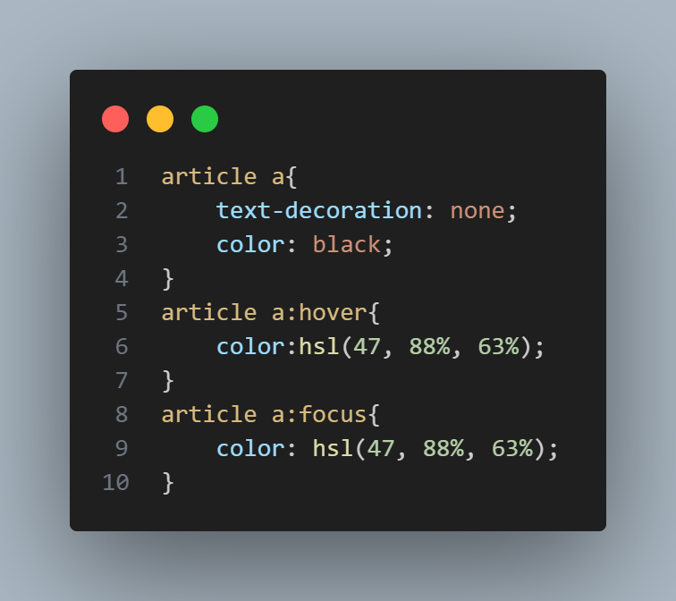

# Frontend Mentor - Blog preview card solution

This is a solution to the [Blog preview card challenge on Frontend Mentor](https://www.frontendmentor.io/challenges/blog-preview-card-ckPaj01IcS). Frontend Mentor challenges help you improve your coding skills by building realistic projects. 

## Table of contents

- [Overview](#overview)
  - [The challenge](#the-challenge)
  - [Screenshot](#screenshot)
  - [Links](#links)
- [My process](#my-process)
  - [Built with](#built-with)
  - [What I learned](#what-i-learned)
- [Author](#author)


## Overview

### The challenge

Users should be able to:

- See hover and focus states for all interactive elements on the page

### Screenshot



### Links

- Live Site URL: [https://blog-preview-card-pi-beige.vercel.app](https://blog-preview-card-pi-beige.vercel.app)

## My process

### Built with

- Semantic HTML5 markup
- Flexbox

### What I learned

I learned how to put a box-shadow on my elements

```css
main{
  width: 300px;
  display: flex;
  justify-self: center;
  flex-direction: column;
  background-color: white;
  box-shadow: 6px 7px 0 black ;
  border-radius: 10px;
  padding: 15px;
  border: 1px solid black;
  margin: 15vh 0 ;
}
```

## Author

- Frontend Mentor - [@Ashura602](https://www.frontendmentor.io/profile/Ashura602)
