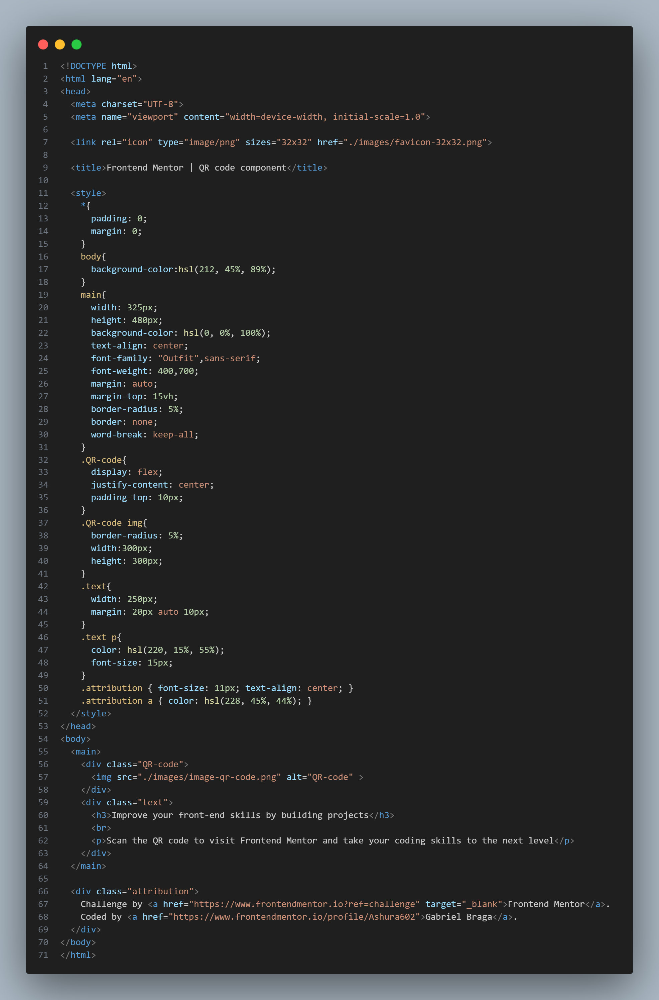

# Frontend Mentor - QR code component solution

This is a solution to the [QR code component challenge on Frontend Mentor](https://www.frontendmentor.io/challenges/qr-code-component-iux_sIO_H). Frontend Mentor challenges help you improve your coding skills by building realistic projects. 

## Table of contents

- [Overview](#overview)
  - [Screenshot](#screenshot)
  - [Links](#links)
- [My process](#my-process)
  - [Built with](#built-with)
  - [What I learned](#what-i-learned)
  - [Continued development](#continued-development)
  - [Useful resources](#useful-resources)
- [Author](#author)
- [Acknowledgments](#acknowledgments)

## Overview

### Screenshot




### Links

- Live Site URL: (https://qr-code-one-gold.vercel.app)

## My process

### Built with

- Semantic HTML5 markup
- Flexbox

### What I learned

I learned how to work with fixed sizes and the real difference about 'display:flex;'.

```css
.QR-code{
  display: flex;
  justify-content: center;
  padding-top: 10px;
}
.QR-code img{
  border-radius: 5%;
  width:300px; 
  height: 300px;
}
```
## Author
- Frontend Mentor - [@Ashura602](https://www.frontendmentor.io/profile/Ashura602)
