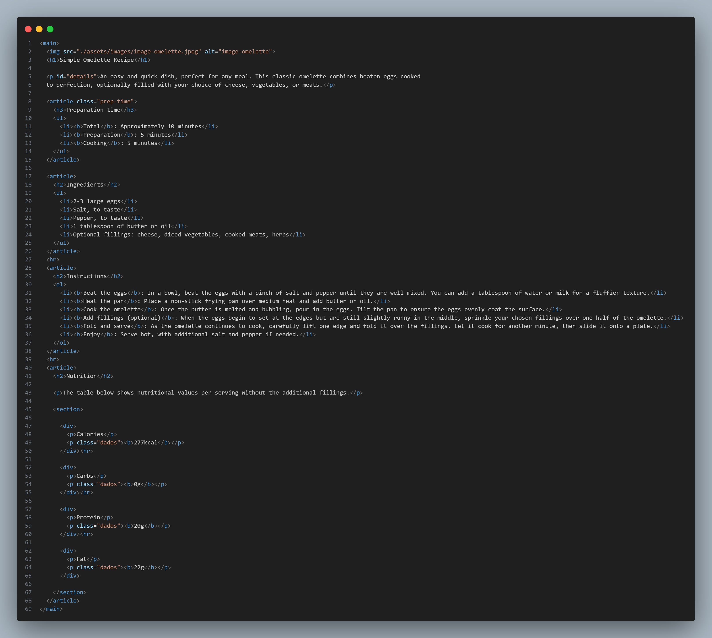
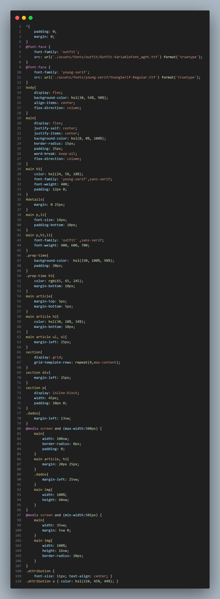

# Frontend Mentor - Recipe page solution

This is a solution to the [Recipe page challenge on Frontend Mentor](https://www.frontendmentor.io/challenges/recipe-page-KiTsR8QQKm). Frontend Mentor challenges help you improve your coding skills by building realistic projects. 

## Table of contents

- [Overview](#overview)
  - [Screenshot](#screenshot)
  - [Links](#links)
- [My process](#my-process)
  - [Built with](#built-with)
  - [What I learned](#what-i-learned)
- [Author](#author)


## Overview

### Screenshot





### Links

- Live Site URL: [https://recipe-page-six-gamma.vercel.app/](https://recipe-page-six-gamma.vercel.app)

## My process

### Built with

- Semantic HTML5 markup
- CSS custom properties
- Flexbox

### What I learned

I learned a litle about @media screen and how to add a new font from my archives to put it on my texts


```css
@font-face {
    font-family: 'outfit';
    src: url('./assets/fonts/outfit/Outfit-VariableFont_wght.ttf') format('truetype');
}
@font-face {
    font-family: 'young-serif';
    src: url('./assets/fonts/young-serif/YoungSerif-Regular.ttf') format('truetype');
}
@media screen and (max-width:500px) {
    main{
        width: 100vw;
        border-radius: 0px;
        padding: 0;
    }
    main article, h1{
        margin: 20px 25px;
    }
    .dados{
        margin-left: 25vw;
    }
    main img{
        width: 100%;
        height: 60vw;
    }
}
@media screen and (min-width:501px) {
    main{
        width: 35vw;
        margin: 5vw 0;
    }
    main img{
        width: 100%;
        height: 16vw;
        border-radius: 10px;
    }
}
```

## Author

- Frontend Mentor - [@Ashura602](https://www.frontendmentor.io/profile/Ashura602)
